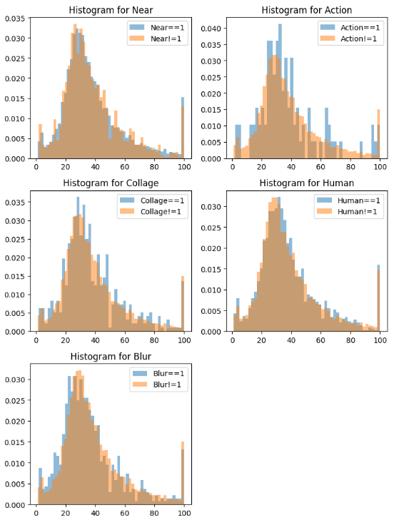

# Predicting Popularity of Shelter Pet Profiles
This repository holds an attempt to apply regression models to pet profiles using metadata from “Petfinder.my - Pawpularity Contest”. https://www.kaggle.com/competitions/petfinder-pawpularity-score/overview.

## Overview
As described by the Kaggle challenge, the task is to analyze raw metadata of photos (ie. blurrines of a photo, if pet’s eyes are seen, etc.) to predict the “Pawpularity” score of a given pet profile. In first approaching this problem, I graphed the data to see if there was an obvious correlation with any of the features of the training dataset and its scores. The problem can be formulated as a regression task, and I compared the performance of 2 different algorithms. Overall, there was not a strong relationship seen in the graphs between the metadata and popularity scores, and my best performing model only scored 28.11 in the root mean squared error.

## Summary of Work Done
### Data
The input data was the .csv file of metadata, including features such as Focus, Eyes, Face, Near, Action, Accessory, Group, Collage, Human, Occlusion, Info, and Blur. The datafile was roughly 583 kilobytes, including both training and test data. I did not include images provided.There were a total of 9,912 data points in the training, which was divided into 7929 for training and 1983 for testing. There was no clean up or preprocessing needed.

### Data Visualization
We see an average Pawpularity score of about 38.04 out 100 and a median of 33. Looking at the histograms of each feature and their score, we do not see much of a difference between 0 for the feature and 1 for the feature.

  

<table>
  <tr>
    <td></td>
    <td></td>
  </tr>
</table>

### Problem Formulation
I split the data with the input being the metadata features and the output being the Pawpularity. I tried two different models - the Decision Tree Classifier and Random Forest Regressor. As the data had binary explanatory variables and a discrete response variable ranging from 1 to 100, I believed one of those two algorithms would work well.

### Training 
First with the Decision Tree Classifier, I split the data into 80% training (X_train, X_test) and 20% testing (y_train, y_test) fitted it into the model. Then with the Random Forest Regressor model, I separated the data into xTrain, xValid, yTrain, and yValid and fit the xTrain and yTrain into the regressor model. I had some difficulties with syntax, but they are now solved.

### Performance Comparison
Here is where I struggled. The Kaggle challenge states that submissions are scored on the root mean squared error (RMSE), where y is the actual value and y-hat is the predicted value.

Using the Decision Tree Classifier model, I scored 28.11 on the RMSE, and using the Random Forest Regression model, I scored 20.51. However, when looking at the accuracy score for the DTC model, the score came back as .0221. And when I calculated r^2 for the RFR model, r-squared came as -0.0172. 

  

### Conclusions
Looking at the accuracy score, r-squared value, and the RMSE, both models show low accuracy rates. Given that the histograms showed little difference between the binary categories in affecting the score, I am not surprised by the low result.

### Future Work
Regarding this project, I would look into the more complex algorithms, like Neural Networks, to see if I would gain a better score. This project was a stepping-stone into the world of machine learning for me and I would like to hone my skills with other research, specifically regarding psychology so I would have a better understanding of the variables and how to approach formulating the problem.

## How to reproduce results
### Overview of files in repository
We have the train.csv file that includes all 9,912 data points, with features and Pawpularity scores. Then, we have Kaggle.ipynb, my first notebook and attempt at approaching this problem: I plotted tables and histograms to get a feel for the data. Then, we have DTC.ipynb, the notebook where I trained the data in a Decision Tree Classifier model. Lastly, we have RFR.ipynb where I trained the data in a Random Forest Regressor model.

### Software Setup
You’ll need the following packages:

  	import pandas as pd
  
  	import numpy as np
  
  	import matplotlib.pyplot as plt
  
 	%matplotlib inline
  
  	from sklearn.tree import DecisionTreeClassifier
  
  	from sklearn.model_selection import train_test_split
  
  	from sklearn.metrics import accuracy_score
  
  	from sklearn.metrics import mean_squared_error
  
  	from sklearn import datasets, metrics
  
 	from sklearn.ensemble import RandomForestRegressor

### Data
On https://www.kaggle.com/competitions/petfinder-pawpularity-score/overview, click on the Data tab. Scroll down and select the train.csv file and download. You can also download the test.csv and sample_submission.csv. There are also photos, but that is another model/problem formulation entirely. I focused only on the metadata.

### Training
First, separate the data into X and y - with X being all the columns excluding Id, Subject Focus, and Pawpularity, and y being just Pawpularity.
  
  	pet_data = pd.read_csv(train)
  
 	X = pet_data.drop(columns=['Id','Subject Focus','Pawpularity'])
  
 	y = pet_data['Pawpularity']

For Decision Tree Classifier:
	
 	model = DecisionTreeClassifier()

 	X_train, X_test, y_train, y_test = train_test_split(X.values,y,test_size=0.2)

  	model.fit(X_train,y_train)
  
  	predictions = model.predict(X_test)

	score = accuracy_score(y_test,predictions)
  
  	score

For Reduced Forest Regression:

	  xVars = data.drop('Pawpularity',axis=1)
	  
	  yVars = data['Pawpularity']
	
	  xTrain, xValid, yTrain, yValid = train_test_split(xVars,yVars,test_size=0.3,random_state=43)
	
	  regressor = RandomForestRegressor(n_estimators=50, random_state=43)
	  
	  y_pred = pd.DataFrame(y_pred, columns=['yPredict'])
	
	  rmse = np.sqrt(mean_squared_error(yValid,y_pred))
	  
	  rmse

	  metrics.r2_score(yValid,y_pred)

## Citations
https://www.kaggle.com/competitions/petfinder-pawpularity-score/data?select=test.csv
https://scikit-learn.org/stable/supervised_learning.html#supervised-learning

